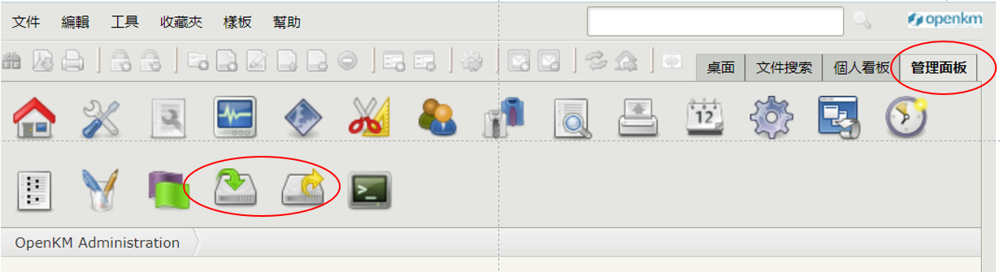
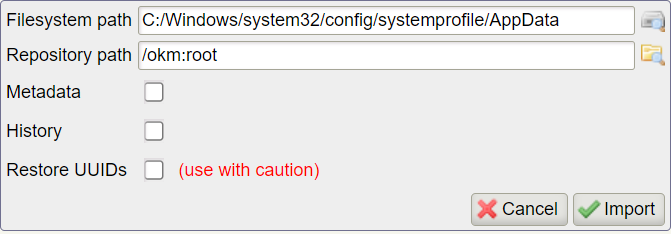

# 管理者全目錄之批次上、下載

{: .no_toc }

  

    Table of contents
  

  {: .text-delta }
- TOC
{:toc}

---

## 背景

- 一般使用者可以用`新增文件`方式，新增文件的zip壓縮檔，openKM會自動解壓縮，達成批次上傳的效果。
- 以整個目錄進行批次上、下載，可以在「`管理面板`」上更有效地進行。這是一般使用者是無法達成的。
- 然而openKM並不是一般的檔案系統，因此也無法以檔案總管、OS等外掛方式來設定。
- 上載(import)畫面如下，上載也類似，只是路徑的順序不同。

- 內設是在伺服器硬碟的`C:/Windows/system32/config/systemprofile/AppData`(window伺服器)、或`/home/openkm`(linux伺服器)，要在目錄之間移動，可以參考下述[檔案系統](#檔案系統)。

- openKM一般進、出目錄是按左邊的目錄名稱，確定要上、下載(Select)是按右側的綠色勾。

- 由於程式限制，目前版本是不會辨認中文目錄的。因此不論是來源或者是目標目錄名稱，都必須先修改成英數文字才能辨識。上、下載後再恢復中文目錄名稱。

## 檔案系統

- 批次上、下載是經由伺服器的作業系統連結到檔案系統，以下以`sino4`為範例。
- 因此檔案目錄必須是在`sino4`上，或者是`sino4`可以連結到的位置。
- 由於`sino4`檔案系統與公司其他系統之間是存在界面的，傳檔的方案有：
  - window系統經由sftp與`sino4`進行檔案上、下載到openkm使用者目錄下，或者其他公共空間(目前在`sino4`:/home下的公共空間有aermod、backup、camxruns、cybee、py\_exam等)，要注意openKM的權限範圍是使用者openkm範圍，不能存取其他私人目錄。
  - 先建立SAMBA由window系統複製到工作站(master)，`sino4`再經由/autofs/master來抓取資料。由於autofs的特性是動態連結，須先以openkm身份在`sino4`上存取/autofs/master內容，系統才知道有哪些目錄，才會在openKM系統中顯示。
