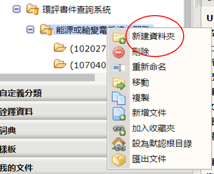
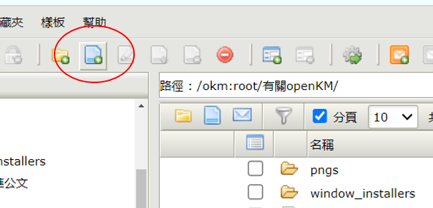
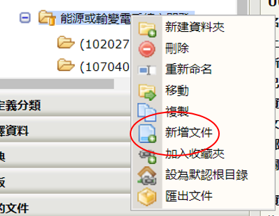
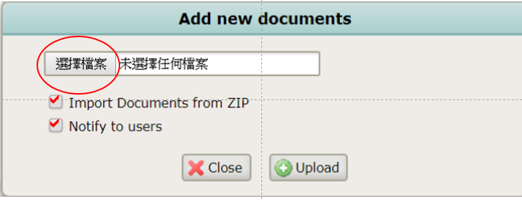
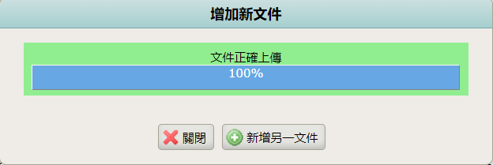

# 節點(資料夾、文件、郵件、訊息)之增減與上下載

{: .no_toc }

  

    Table of contents
  

  {: .text-delta }
- TOC
{:toc}

---

## 背景

- 在OpenKM中所謂的節點(node,包括資料夾、文件、郵件、訊息等)，在資料庫中形成一個單元，其內容則會拆解成個別封包分別儲存，以增加全文搜尋的速度。

## 新建/刪除資料夾

- 使用者可以在具有寫入權限的地方，創建新的資料夾(目錄)或刪除，
  - 位置包括「`公共文件`」「`自定義分類`」與個人空間
  - 使用者也可以進行安全管理，決定對哪些角色或使用者個人開啟權限。
- 個人空間不論權限如何設定，其他非管理者個人無法讀取。

### 新建資料夾

- 可以點選原目錄、按右鍵出現功能項目，第一項即為新建資料夾。

### 資料夾重新更名

- openKM可以接受`f2`按鈕出現名稱，可以複製資料檔內容、或予以更名。

## 文件上載

1. 檔案必須有所歸屬，因此必須先點選目錄，再按`新增文件`(Add document、如下圖，將會在「/okm:root/有關openKM」目錄下新增文件)，

- 或點選目錄後按右鍵，出現功能選項中點選「`新增文件`」如下圖。

2. 一次上載多個檔案，必須先將檔案壓縮成zip檔。選取此處的「從zip壓縮包中匯入資料(Import Documents from ZIP)」。**注意**：如果沒有勾選zip檔，上載後不會自動解壓縮，仍然是zip檔。
3. 如果要「通知用戶」notify to user，需要先勾選方框，詳下[說明](#通知用戶功能)。
4. 按左側「選擇檔案」鍵，會開啟window的檔案總管介面，選好檔案後右側會出現檔名，再按Upload即可。(如圖示)

5. 如果(zip)檔案很大、會出現進度如圖。
6. 如果要在同一目錄再「新增另一文件」檔案，可以在同畫面繼續進行。必須按下「關閉」才能離開。

### 通知用戶功能

- 此一通知有廣播的作用，可以將檔案的基本介紹寫在message(通知消息)框架內，選擇使用者、或者群組(角色)，上載的同時就會通知其他人上來看檔案。
- 選擇時要注意是否有勾選「過濾」，如果勾選了，將無名單顯示，須先取消「過濾」才能選擇。
- 如果方向鍵不能作用，試看看不同方向。

### email通知功能

- 如果伺服器沒有收信的功能，也不會留存寄件備份，可以在external mail address寫下自己的email，這樣OpenKM也會寄一份通知給自己做為備份。
- 由於通知消息的格式語法是html格式，換行必須加註` `，段落設定則為`
…
`。
- 注意：
- linux OpenKM CE版跨window沒有拉放功能，
- 非管理者沒有批次上傳功能，批次上下載詳[後述]()。
- ZIP上傳可以有批次上傳的效果，但只接受ZIP內英文檔名

## 下載

- 點選要下載的檔案，按滑鼠右鍵Download即可下載到window個人的Download(下載) 目錄。
- 目前OpenKM_CE版還沒有「只允許讀取」卻不能「下載」功能，因此如果有檔案不允許別人下載，建議連讀取都不必開放。

